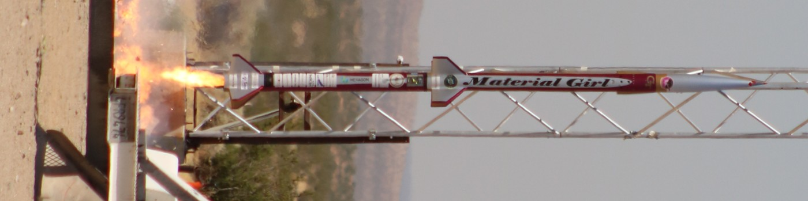
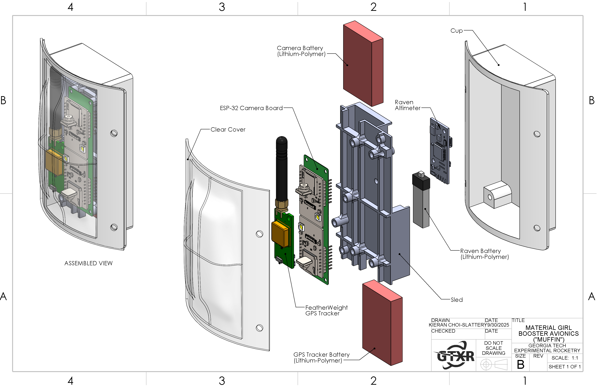
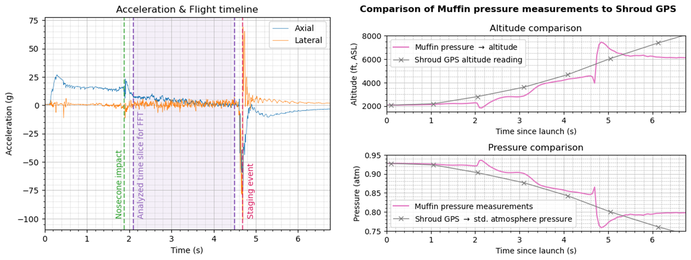
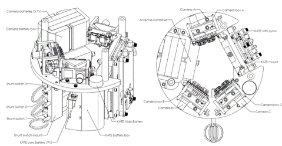
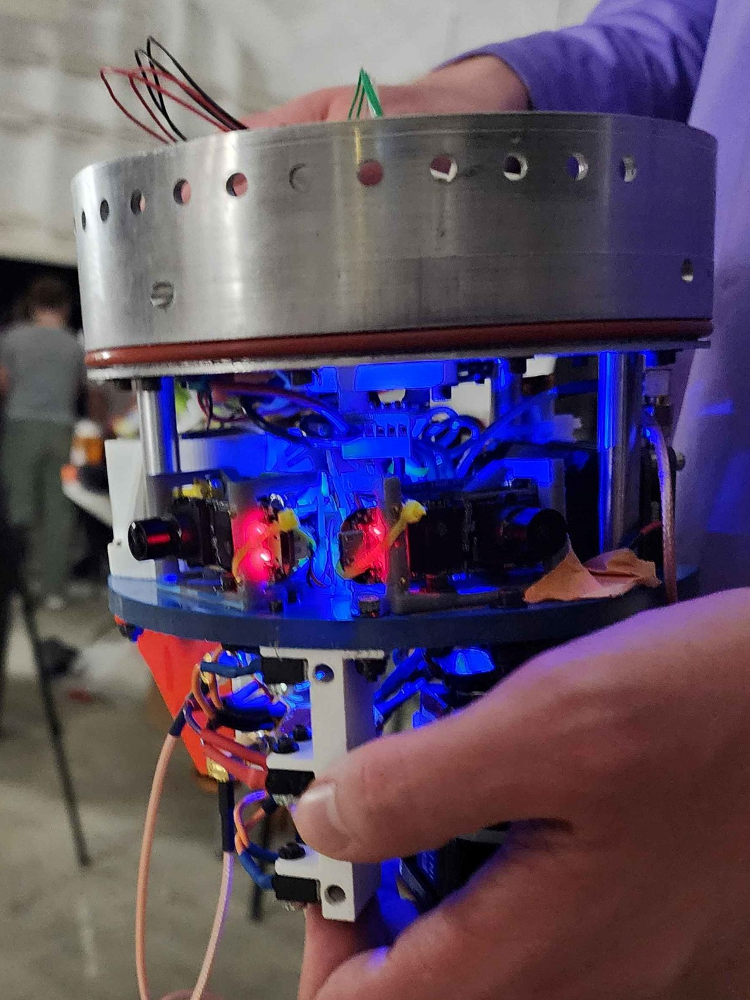

In my second and third years of college, I developed avionics bays with Georgia Tech Experimental Rocketry (GTXR).

## The Muffin

### Design and Manufacturing

The first was the booster bay for GTXR's rocket *Material Girl*, affectionately dubbed "The Muffin" because of its shape. It was of an innovative form factor, being able to be installed from the outside of the rocket, even after the rest of the rocket had been assembled. This accessibility was criticially useful for battery life and debugging issues.

Material Girl<i> taking off on the pad (sideways image). The Muffin can be seen as the green light just left of the upper-stage fins.</i>
 

It was also a test of new manufacturing techniques and their viability for flight hardware. The sled was FDM-3D-printed and the cup was printed out of Formlabs Durable resin.
The cover was polycarbonate and vacuum-formed, which was a manufacturing technique that had never been done by GTXR.

<i>Labeled diagram of the Muffin.</i>
 

<video src="images/muffin-installed.mp4" height="500" display="block" controls></video>

<i>The Muffin integrated in the lower staging flange of</i> Material Girl. <i>Click to play video.</i>
 

### Reults

*Material Girl* ended up hot-staging due to a software bug in an off-the-shelf flight computer and the Muffin was ejected thousands of feet in the air. However, with the exception of one battery and one micro-SD card, all components were recovered by a meticulous sweep based on estimated trajectory.

<i>The Muffin after being ejected by a the hot-stage and falling thousands of feet. The charred material is likely burned scraps of the parachute, which was ignited by the sustainer motor.</i>
 

Unfortunately, the cameras only recorded a few frames of the flight since their power cut out after hot-staging and their buffer was flushed. This was not the first time that we had recovered cameras that magically had very little or bad footage, and it would not be the last, as you will see.
However, the data recorded by the altimeter was useful for analysis of g-loading and determining when the hot-stage occurred. The altitude stays roughly with the rest of the rocket up until the staging event, and the battery disconnects shortly after.

<i>Data recorded by the muffin during its short flight.</i>
 

## The Camera Ring(s)

TODO: Write about this

