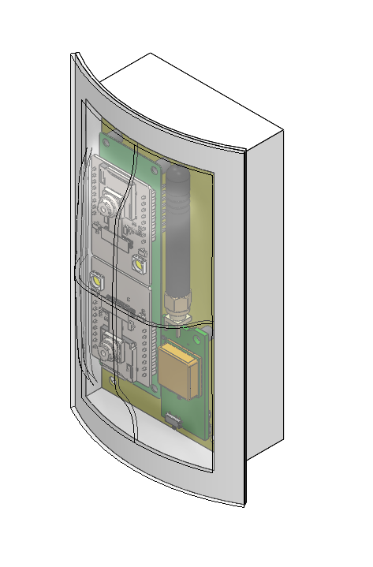

The lower-stage avionics bay for Georgia Tech Experimental Rocketry's 2022-2023 rocket *Material Girl*.

*CAD of the Muffin.*

*The Muffin after being ejected by the second-stage motor firing into it and falling 300 feet from the sky.*