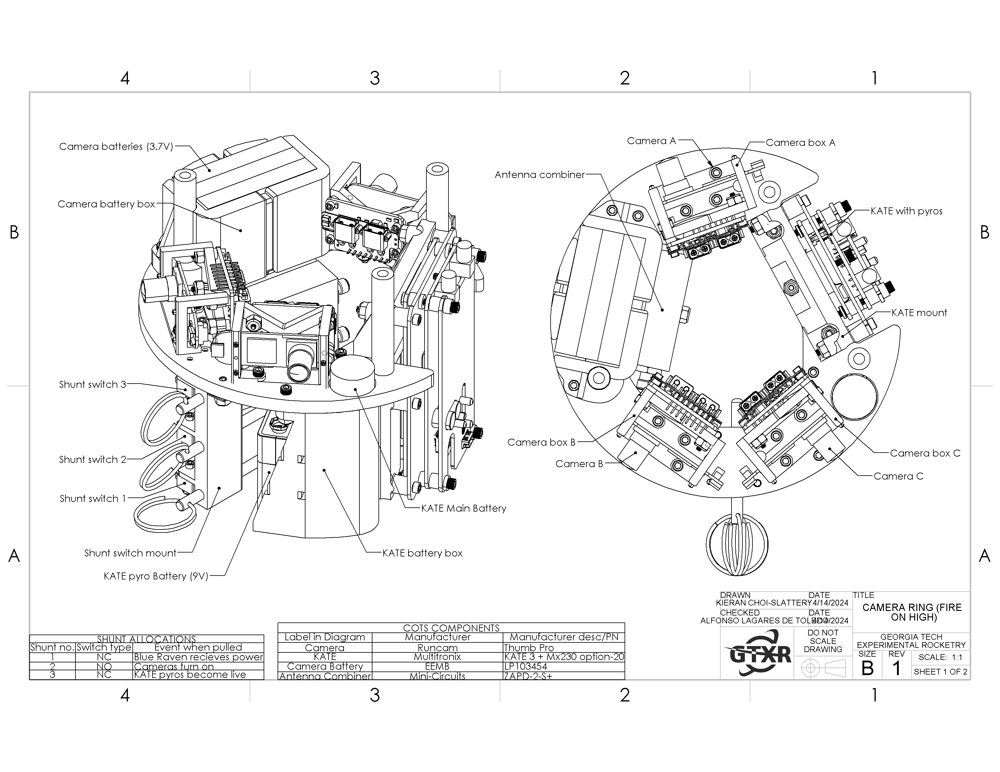

*It's alive!*

The pages are generated from raw markdown files, which allows editing it to be straightforward and allows me to focus on just creating the content. Features include:

## Headers

### Subheaders

## Equations

Just like normal markdown, this supports inline equations, such as $ax^2+bx+c$, as well as more advanced block equations, such as:

$$\int_{\theta_\mathrm{min}}^{\theta_\mathrm{max}}\left\{\left[\frac{\log{a}}{\sqrt{b}}+\mu^{-2\alpha}\right]\left[\left(\begin{pmatrix}\sigma_{xx} & 0 \\ 0 & \sigma_{yy}\end{pmatrix}\mathbf{q}\times\mathbf{w}\right)\cdot\mathbf{p}\right]\right\}\sin{\theta}\, d\theta$$

## Images

Also just like normal markdown, this supports images:

